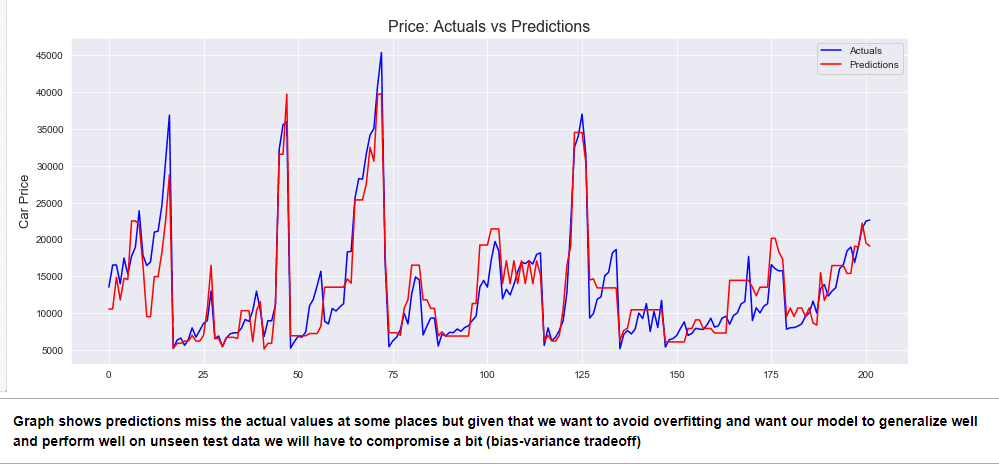
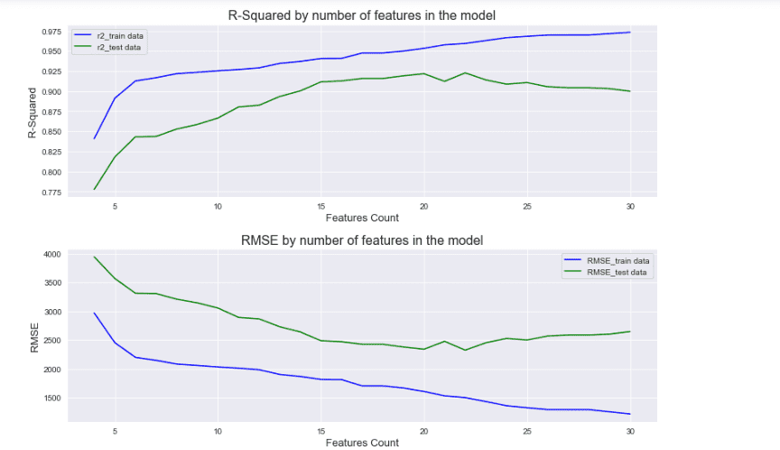
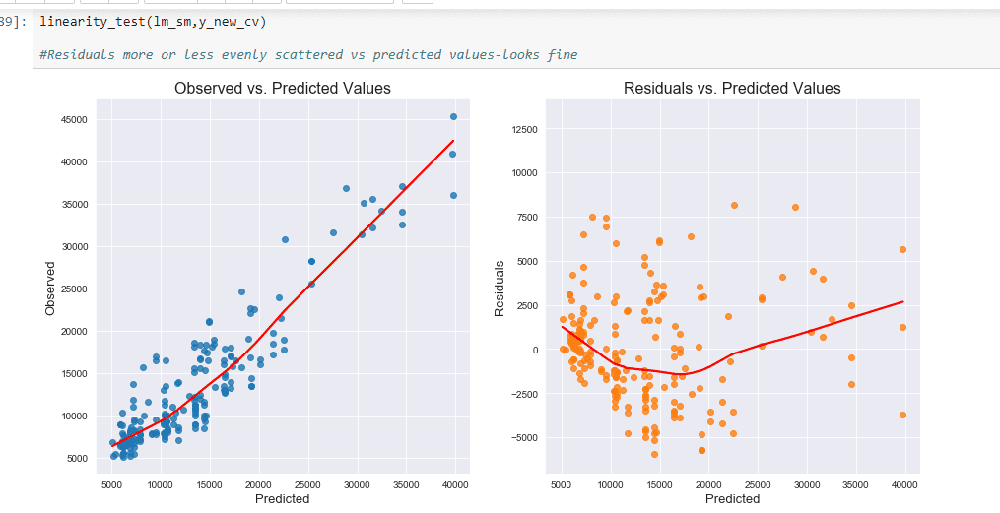
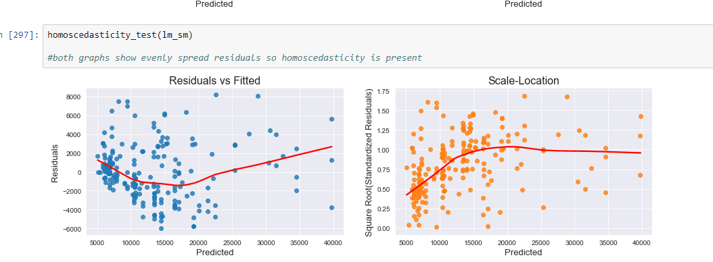
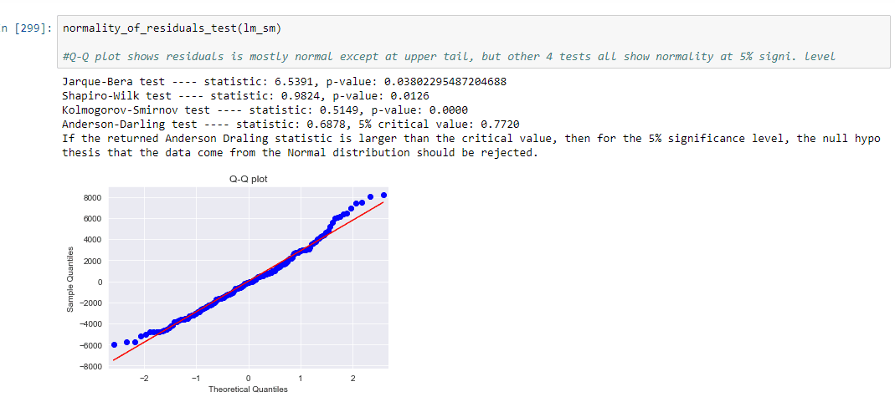
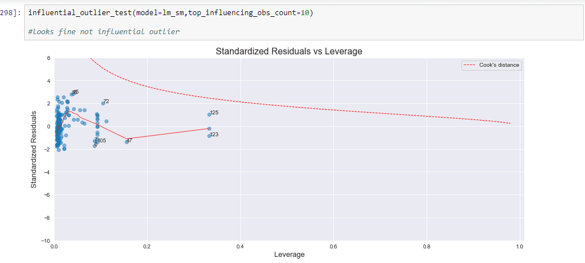

# Car Price Prediction: Highly Comprehensive Linear Regression Project

**A Linear Regression model to predict the car prices for the U.S market to help a new entrant understand important pricing factors/variables in the U.S automobile industry**. A highly comprehensive analysis with all data cleaning, exploration, visualization, feature selection, model building, evaluation and MLR assumptions validity steps explained in detail.

## The jupyter notebook has following sections:

1- Data understanding and exploration 

2- Data cleaning

3- Data preparation: Feature Engineering and Scaling

4- Feature Selection using RFE and Model Building  

5- **Linear Regression Assumptions Validation and Outlier Removal**

6- **Rebuilding the Model Post Outlier Removal: Feature Selection using K-Fold Cross Validation & RFE**  

7- **Removing Multicollinearity, Model Re-evaluation and Assumptions Validation**

# Visualizations Excerpts

## Model Predictions vs Actual Values

## R-Squared & RMSE by number of features (Derived using K-Fold and Recursive Feature Elimination)

Determining optimum number of features in model by checking performance metrics R-Squared and RMSE at different counts of features

## Linear Regression Assumptions Validation

**Assumption_Presence of Linear Relationship**: Holds as residuals more or less evenly scattered vs predicted values

**Assumption_Presence of Homoscedasticity**: Both graphs show evenly spread residuals so homoscedasticity is present

**Assumption_Normality of Residuals**: Q-Q plot shows residuals is mostly normal except at upper tail, but other 4 tests all show normality at 5% signi. level

**Assumption_Absence of Outliers**: No point beyong cooks distance line so no outlier is present

# The final model meets all the assumptions including no mutlicollinearity and has an R-Square of 86% which is satisfactory given small dataset/less data for training the model.
